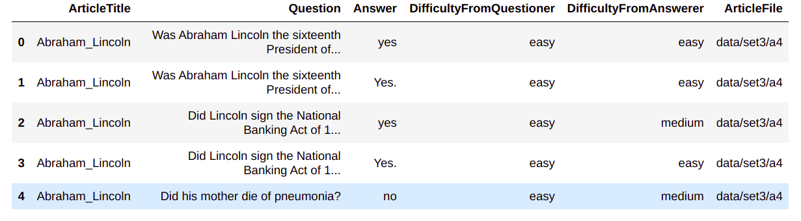
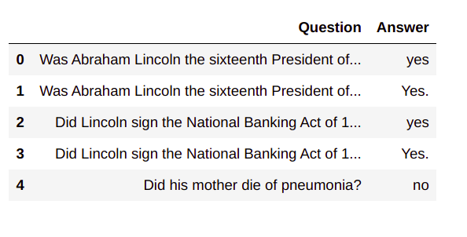
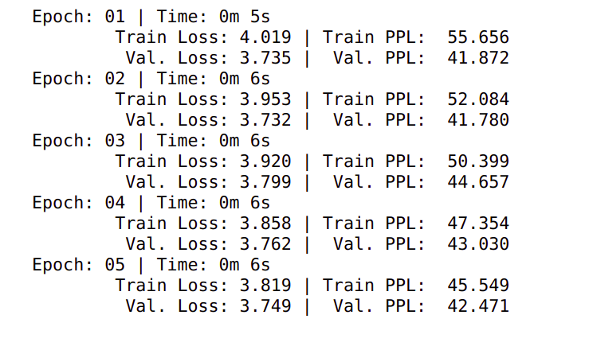
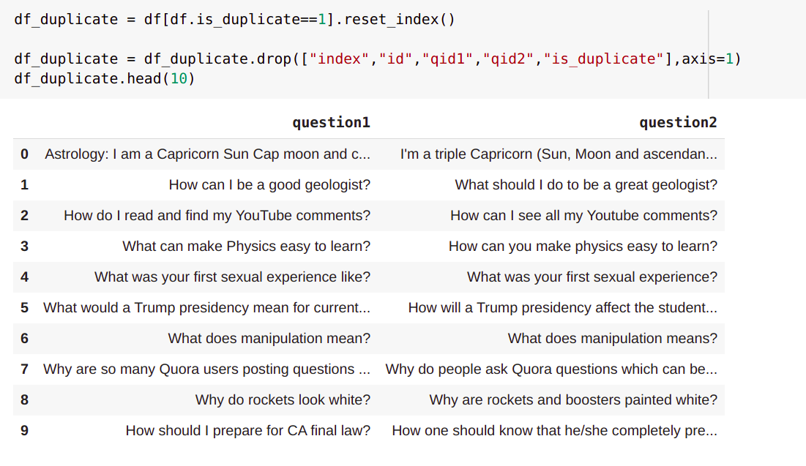
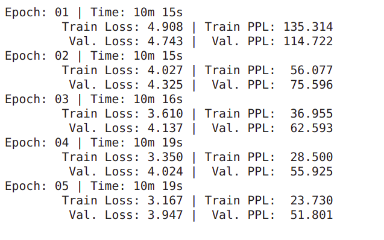
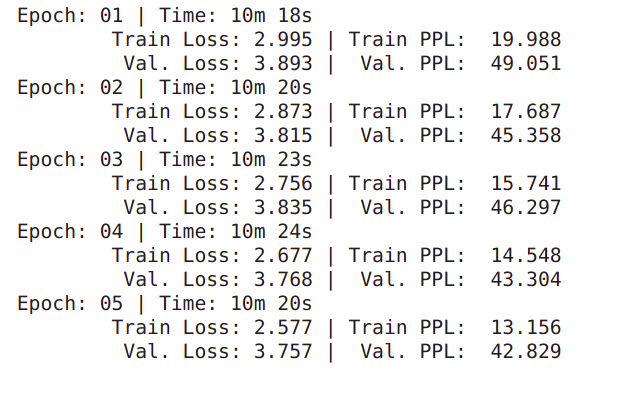

# Using Seq2Seq Architecture to solve NLU problems 

## A. CMU Question Answer Dataset

The original intent of the CMU question Answer dataset, seems to have been to build an NLU model, that reads the 
articles collected in the database, and then answers questions when asked. However, we will be skipping the reading 
the article aspect( typically done by a language model) and move straight to QA. 

Consequently, due to low data and feature info, the performance will be poor, but the subsequent quora dataset will have
great results, and the point is moslty to understand the dataflow.

### 1. Data Handling

The dataset has interesting information such as

Level of difficulty for Questioner
Level of difficulty for  Answerer
The article from which the Question is being asked etc 

However, for our purposes, we are only intersted in the Q and A

### 2. Training and Validation Data 

So we just drop the unnecessary columns, reset the index, split the data 
using sklearn and we're on our way!

### The rest of the procedure is essentially the same as the hands-on procedure, 
with the exception being the use of the English tokenizer for input and Target.

The logs and the perplexity( since accuracy doesn't make sense here)

## B. Quora Similiar Question Dataset

While the original intention of the dataset, was to find out similar questions, and cluster them together for 
easier access, the goal of this notebook is to build a model that takes in a question as an input and produces a
similar question as an output.

### 1. Loading and handling the dataset 

The orignal dataset hFirst Round traininas a bunch of fields

id	qid1	qid2	question1	question2	is_duplicate

only 3 and 4 of which are needed for us, and even among them, we only need questions that have near duplicate meaning, 
they can be filtered to form our dataset.

#### **Note**: Due to the large amount of data available, and the fact that context of the input and target are very close, 
####the model shows much greater performance than on the QA dataset. The Procedure is almost completely the same as above

### 2. Training Logs 

**First Round training**

**More Training**

